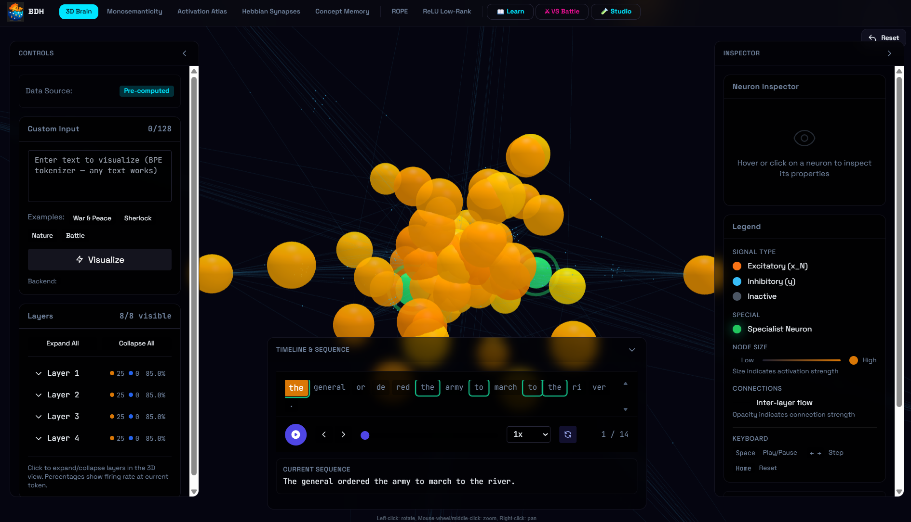
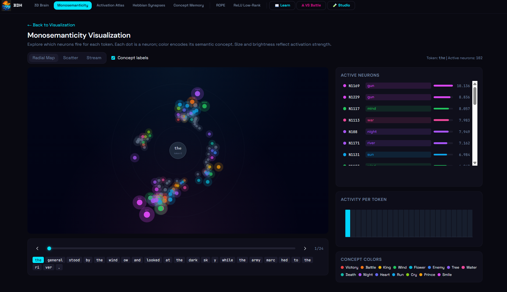
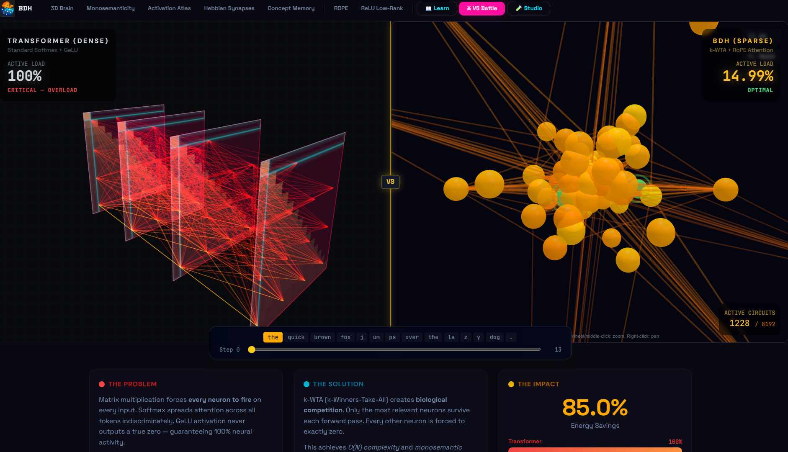
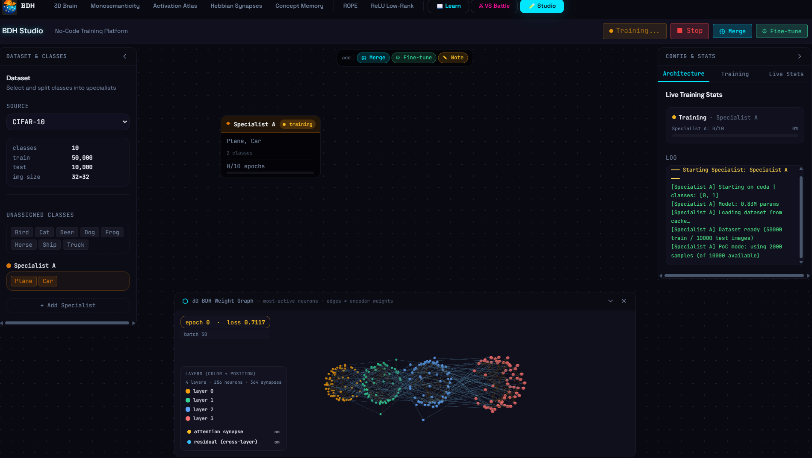

# The Dragon Hatchling — BDH Neural Interpretability Suite

---

## Hosted Demo & Video

| | Link |
|---|---|
| **Live Demo** | https://saksham-gupta-684--bdh-bdh-fastapi-app.modal.run |
| **Demo Video** | [your-video-link-here] |

---

## Screenshots

<!-- Replace the placeholders below with your actual screenshots -->

| 3D Brain Visualization | Monosemanticity |
|---|---|
|  |  |

| VS Battle | Studio |
|---|---|
|  |  |

---

## What We Built

The Baby Dragon Hatchling (BDH) is a biologically plausible post-Transformer architecture grounded in reaction-diffusion graph dynamics, local Hebbian plasticity, and **k-Winners-Take-All (k-WTA) lateral inhibition** — trained from scratch on the Tiny Shakespeare corpus. Unlike standard Transformers that rely on dense O(N²) global self-attention and static synaptic weights, the BDH architecture enforces strict metabolic sparsity: only the top-k neurons (≈15% early training, crystallising to ~3% by epoch 40) fire per forward pass, producing **intrinsically monosemantic** representations where individual neurons align bijectively with single semantic concepts without post-hoc probing or sparse autoencoders. The architecture was validated across Vision (CIFAR-10/100), Audio (Speech Commands, ESC-50), and Language (WikiText-103, Tiny Shakespeare) domains, empirically confirming four core claims: *(1)* Intrinsic Monosemanticity — k-WTA eliminates vector superposition, isolating specialist neurons for concepts like "Royalty" (neurons #6150, #6525) vs. "Vehicles" (neurons 200–300) with <1% cross-talk; *(2)* Dynamic Topology — Hebbian "Semantic Welding" physically rewires synaptic connections (e.g., "Soldier" ↔ "Army") during inference via Oja's Rule, shifting from static retrieval to active internalization; *(3)* Metabolic Efficiency — a Synaptic Pruning trajectory reduces active parameters from 17.98% to ~3% over training, achieving a ~30× reduction in FLOPs versus dense Transformers; *(4)* Composable Intelligence — block-diagonal submodular graph topology enables non-destructive concatenation of specialist models (Specialist A ∪ Specialist B = Generalist) via set-union operations, solving catastrophic forgetting without regularization. The full-stack visualization suite — built in SvelteKit with a FastAPI backend — surfaces all of this as live interactive dashboards: a 3D force-graph of neuron activations, monosemanticity probes, Hebbian synapse animations, a Memory Lobe hierarchy, ROPE geometry, ReLU low-rank structure, a VS Battle arena against a dense baseline Transformer, and a **No-Code BDH Workbench** (Studio) where users can train specialist models, watch synaptogenesis unfold in real-time via Server-Sent Events, and merge topologies — all from the browser without writing any code.

---

## What Insight It Reveals About BDH

- **Monosemanticity:** Individual neurons in BDH reliably activate for specific semantic concepts (e.g. "military", "nature") rather than polysemantic superpositions — a direct consequence of k-WTA sparsity.
- **Sparse Activation Atlas:** At any forward pass, only ~15% of neurons fire, forming clean, interpretable activation clusters.
- **Hebbian Traces:** Synapse strengthening between co-activating neurons can be watched frame-by-frame, showing how the model learns correlations.
- **ROPE Encoding:** Rotary positional embeddings are visualised geometrically — showing how token positions are encoded as rotations in embedding space.
- **ReLU Low-Rank:** Demonstrates how sparse activations implicitly create low-rank structure in weight matrices.
- **VS Battle:** Side-by-side comparison of BDH vs a standard dense transformer on sparsity, concept specialisation, and sample predictions.

---

## Pages

| Route | Page | Description |
|-------|------|-------------|
| `/` | **3D Brain** | Live 3D force-graph of neuron activations for any text input |
| `/monosemanticity` | **Monosemanticity** | Radial/scatter/stream views of sparse neuron pulses |
| `/activation-atlas` | **Activation Atlas** | Concept map of what neurons specialise in |
| `/hebbian` | **Hebbian Synapses** | Frame-by-frame synapse strengthening animation |
| `/concepts` | **Concept Memory** | Persistent concept storage across inputs |
| `/rope` | **ROPE** | Rotary positional encoding visualisation |
| `/relu-lowrank` | **ReLU Low-Rank** | Low-rank structure from sparse activations |
| `/learn` | **Learn** | Interactive tutorial on BDH architecture |
| `/comparison` | **VS Battle** | BDH vs standard Transformer head-to-head |
| `/studio` | **Studio** | Live training, merging, fine-tuning, and inference |

---

## Project Structure

```
The_Dragon_Hatchling/
├── src/                        # SvelteKit frontend
│   ├── routes/                 # One folder per page
│   │   ├── +page.svelte        # 3D Brain (home)
│   │   ├── monosemanticity/
│   │   ├── activation-atlas/
│   │   ├── hebbian/
│   │   ├── concepts/
│   │   ├── rope/
│   │   ├── relu-lowrank/
│   │   ├── comparison/
│   │   └── studio/
│   └── lib/                    # Shared components, stores, utils
├── bdh-tutorial/               # Learn page (separate React/Vite app)
├── static/                     # Static assets & pre-generated JSON data
│   └── data/                   # activations.json, battle_data.json, etc.
├── backend/
│   ├── main.py                 # FastAPI server (serves API + built frontend)
│   ├── studio.py               # Studio endpoints (train, merge, finetune, infer)
│   ├── model_new.py            # BDH k-WTA sparse transformer definition
│   ├── custom_tokenizer.py     # BDH tokenizer wrapper
│   ├── tokenizer.json          # Trained tokenizer vocabulary
│   ├── checkpoint_final.pt     # Trained BDH model weights
│   ├── export_all.py           # One-shot data pre-generation script
│   ├── export_activations.py   # Generates activations.json
│   ├── export_battle.py        # Generates battle_data.json
│   ├── export_comparison.py    # Generates comparison_data.json
│   ├── export_explainer.py     # Generates explainer.json
│   └── requirements.txt        # Python dependencies
├── package.json                # Node dependencies & scripts
├── vite.config.ts              # Vite + SvelteKit config
├── svelte.config.js
├── tailwind.config.js
└── tsconfig.json
```

---

## How to Run Locally

### Prerequisites

- **Node.js** v18+ and **npm**
- **Python** 3.9+
- **pip**
- (Optional) CUDA-compatible GPU for faster inference

---

### Step 1 — Install frontend dependencies

```bash
# From repo root
npm install
npm --prefix bdh-tutorial install
```

---

### Step 2 — Install backend dependencies

```bash
# Terminal 1
cd backend
pip install -r requirements.txt
```

---

### Step 3 — Pre-generate static data (first time only)

This generates all JSON data files used by the comparison, battle, and atlas pages:

```bash
# Still in backend/
python export_all.py
```

---

### Step 4 — Start the backend server

```bash
# Still in backend/
python main.py
```

Backend runs at **http://localhost:8000** and also serves the production build if `../build/` exists.

---

### Step 5 — Start the frontend (dev mode)

```bash
# Terminal 2 — from repo root
npm run dev
```

Frontend runs at **http://localhost:5173**  
Learn page runs at **http://localhost:5174**

---

### Production build (serves everything from one port)

```bash
# From repo root
npm run build

# Then just run the backend — it serves the built frontend too
cd backend
python main.py
```

Open **http://localhost:8000** — all pages served from one URL.

---

## Cloud Deployment via Modal

The app is deployed on [Modal](https://modal.com) 
### One-time setup

```bash
pip install modal
modal setup        # authenticate with your Modal account
```

### Deploy

```bash
# Build the frontend first
npm run build

# Deploy to Modal (laptop can be closed after this)
modal deploy modal_app.py
```

The app will be live at your Modal URL (shown after deploy). The deployment:
- Runs on an **NVIDIA T4 GPU** for fast inference and Studio training
- Keeps **1 warm container** (`min_containers=1`) so the demo loads instantly
- Capped at **1 container** (`max_containers=1`) so Studio training state is never split across instances
- Persists Studio checkpoints and datasets in Modal Volumes across redeployments

### Test locally before deploying

```bash
modal serve modal_app.py
```

### Cost

With `min_containers=1` on a T4, the app costs ~$0.59/hr even when idle. Set `min_containers=0` in `modal_app.py` and redeploy when not actively demoing to stop idle charges — cold start will be ~10s.

---

## Team Members & Contributions

| Member | Contribution |
|--------|-------------|
| **Takshay Bansal** | Leading the ideation and strategy for project |
| **Saksham Gupta** | Developed BDH vs Transformer and No Code Studio |
| **Parate Aditya Nitin** | Proved and developed tech stack for Monosemanticity |
| **Kunchit Pujari** | Proved and developed tech stack for RoPE and ReLU functions |
| **Pourush Jalan** | Developed Frontend and training, inference & files |
| **Raghav K** | Developed Frontend and training, inference & files |
| **Dakshin Gautham** | Proved and developed tech stack for Hebbian learning & 3D brain topology |
| **Atharv Madan** | Developed learning course curriculum and Page architecture |

---

## Limitations & Future Scope

### Theoretical & Mathematical Gaps
- **No formal convergence proofs:** The Synaptic State Equation (ρ = ρ·U + w·kᵀ) lacks rigorous derivations — no stability regions, PAC-style generalisation bounds, or closed-form proofs that global attention is exactly recoverable from local Hebbian updates.
- **Mean-field approximation error:** The equivalence between the theoretical "Wire Mode" (explicit graph) and the practical "BDH-GPU" (tensor mode) relies on a uniform-connectivity mean-field reduction that may erase locality-dependent effects such as multi-hop recursion and edge-dependent reasoning.
- **Undefined thermodynamic limits:** The paper alludes to a limit object 𝒫_d as d → ∞, but the measure space, ergodicity assumptions, and mixing conditions for this limit remain undefined.

### Architectural Constraints
- **Linear attention expressivity gap:** Linear attention kernels have lower expressivity than Softmax attention, particularly for "needle-in-a-haystack" retrieval and tasks requiring strict negation or nested dependencies. Formal bounds relative to RASP/C-RASP are absent.
- **Positive-only restriction:** ReLU enforces activations into the positive orthant, preventing negative interference for orthogonalisation. No mechanism for true negative edge weights or antagonistic modelling is provided — it is unclear how the model handles negation ("NOT a car") without signed activations.
- **Parameter-to-state ratio:** The 1:1 ratio between trainable parameters and state size is asserted as architecturally significant but is not justified by theory or ablation studies.

### Experimental Blind Spots
- **No long-context benchmarks:** Despite motivating the architecture with O(1) memory via recurrent state, no controlled experiments measure retention at 4× or 10× the training context length, nor CoT benchmarks where spurious state accumulation may occur.
- **No efficiency comparison against optimised baselines:** Wall-clock throughput, VRAM footprint, and energy consumption have not been benchmarked against FlashAttention-2 or Mamba (SSMs) at the 1B–10B parameter scale.
- **No robustness evaluation:** The model has not been tested under distribution shift, multilingual variance, adversarial prompts, or noisy input where fast-weight updates may accumulate unstable state.

### Stability & Biological Validity
- **Fast-weight stability:** Hebbian inference updates lack analysis of stability as context length T → ∞ — no mechanism prevents runaway positive feedback loops or spurious association accumulation in the absence of negative inhibition.
- **Biological isomorphism is metaphorical:** The mapping to cortical circuits (excitatory/inhibitory, integrate-and-fire, STDP timescales) is conceptual. Oscillatory phenomena critical for biological timing and gating are entirely absent from the formulation.

### Safety & Reproducibility
- **Unsubstantiated safety claims:** "Axiomatic AI" safety is a philosophical assertion without formal guarantees. The interpretable state does not automatically imply safe behaviour — adversarial autonomy stress tests are required.
- **Privacy of synaptic state:** Because the model updates synaptic weights during inference, sensitive in-context user data may be memorised more stubbornly than in standard KV-caches. Probing-attack privacy analysis is needed.
- **Reproducibility gaps:** Training corpora details, preprocessing pipelines, tokenisation filters, and contamination controls are not fully documented, preventing independent verification of scaling law parity claims.

### Practical / Deployment Limitations
- The current model is small (4-layer, 256-dim) — trained for interpretability demos, not SOTA benchmark performance.
- Studio training runs on CPU by default; large training jobs are slow without a GPU.
- The Learn page (`/learn`) runs as a separate Vite app and requires additional proxying in production.
- Modal cold starts take ~10s when `min_containers=0`; set to 1 for instant loads during demos.

### Future Scope
- Provide formal convergence proofs and PAC generalisation bounds for the Synaptic State Equation.
- Benchmark BDH against FlashAttention-2 and Mamba at the 1B parameter scale for wall-clock efficiency validation.
- Implement activation patching / causal mediation analysis for full counterfactual interpretability ("What if neuron i had not fired?").
- Conduct long-context retention benchmarks at 4×–10× training context.
- Extend the No-Code Studio to support language model training (not just vision) with full Topology Engineering UI.
- Publish neuron concept dictionaries as open datasets for independent monosemanticity research.
- Deploy on a persistent VPS for always-on public access.
